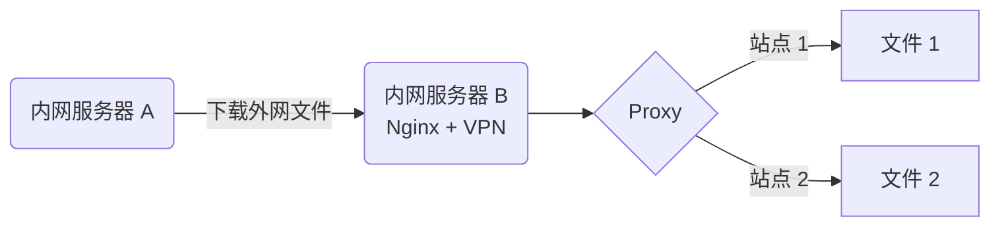

经常要在服务器端下载海外资源，遇到最多的问题就是访问缓慢或不可达，访问 Github 资源还可以用免费的 [Github Proxy](https://ghproxy.com/) ，但局限于只能访问 Github 资源，对于不是 Github 的资源没有办法了，因此通过内网中另外一台有 VPN 的电脑实现类似 Github Proxy 的功能。


示意图如下：


## Nginx 配置

```conf
resolver 8.8.8.8 8.8.4.4;

server {
    listen  80 default_server;

    client_max_body_size  0;

    set $proxy_scheme http;
    if ($request ~* "^\S+ /https://") {
        set $proxy_scheme https;
    }

    set $proxy_domain "";
    if ($request ~* "^\S+ /[^/]+://([^/]+)") {
        set $proxy_domain $1;
    }

    set $location @not_found;
    if ($proxy_domain != "") {
        set $location @proxy_$proxy_scheme;
    }

    set $proxy_request_path /;
    if ($request ~* "^\S+ /[^/]+://[^/]+(/[\S^\?]*)") {
        set $proxy_request_path $1;
    }
    if ($proxy_request_path ~* "^(.*)\?") {
        set $proxy_request_path $1;
    }

    location / {
        try_files  /dev/null $location;
    }

    location @not_found {
        try_files  /dev/null =404;
    }

    location @proxy_https {
        rewrite ^.*$  $proxy_request_path break;

        proxy_ssl_server_name  on;
        proxy_ssl_name         $proxy_domain;
        proxy_pass             https://$proxy_domain;
    }

    location @proxy_http {
        proxy_pass  http://$proxy_domain;
    }
}
```

## 使用代理

使用代理时，只需要在原始 URL 前加上：`http://SERVER_IP/`。
