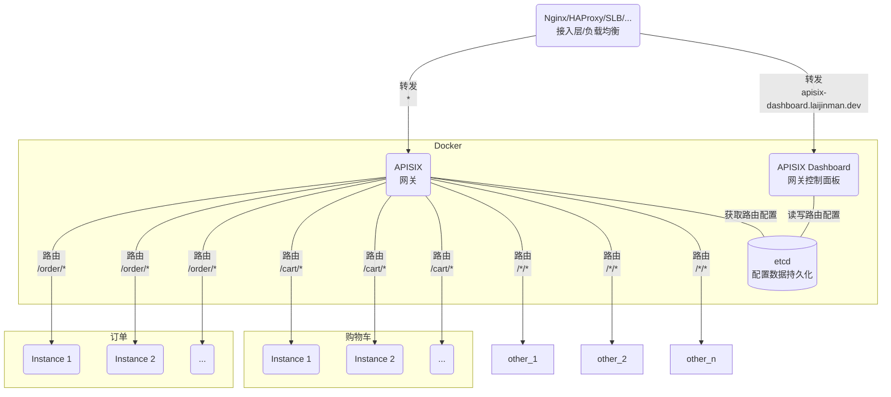
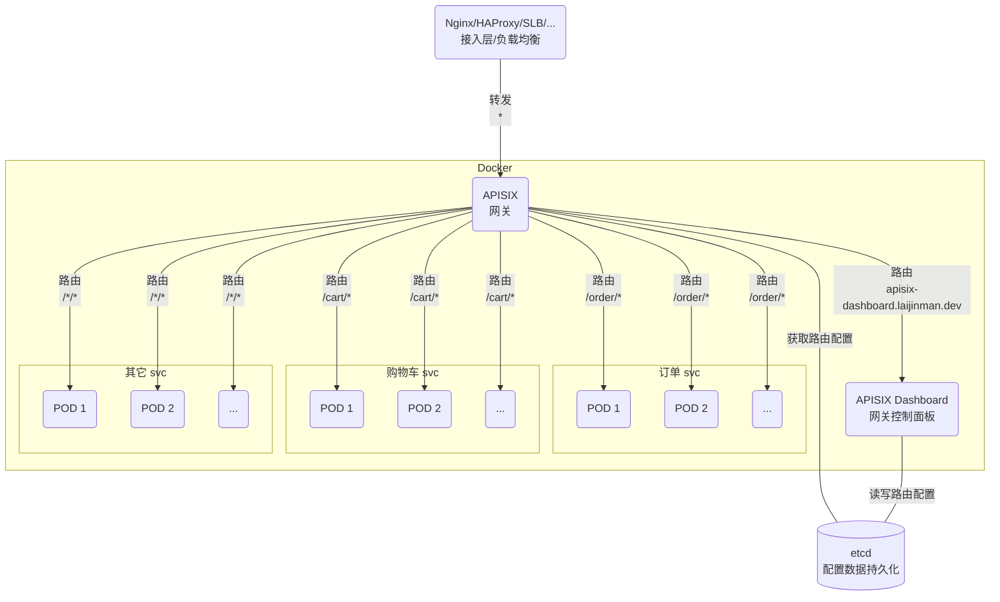

Docker 和 K8S 方式部署 [APISIX](https://apisix.apache.org/zh/) 网关。

## 在 Docker 部署

### 部署 etcd
```yaml
version: "3"

networks:
  home:
    name: home

volumes:
  etcd-data:
    name: etcd-data

services:
  etcd:
    container_name: etcd
    environment:
      ALLOW_NONE_AUTHENTICATION: "yes"
      ETCD_ADVERTISE_CLIENT_URLS: "http://etcd.home:2379"
      ETCD_LISTEN_CLIENT_URLS: "http://0.0.0.0:2379"
    hostname: etcd.home
    image: bitnami/etcd:3.5.10
    networks:
     - home
    ports:
    - 2379:2379
    - 2380:2380
    read_only: true
    restart: unless-stopped
    volumes:
    - etcd-data:/bitnami/etcd
```
{: file='docker-compose.yml'}
> 确保 `ETCD_ADVERTISE_CLIENT_URLS` 配置可被 APISIX 和 APISIX Dashboard 解释和访问有效，否则可能会出现读写 etcd 配置数据时异常。
{: .prompt-warning }

### 部署 APISIX
APISIX 配置文件：
```yaml
deployment:
  role: traditional
  role_traditional:
    config_provider: etcd
  admin:
    admin_key:
      - name: admin
        key: edd1c9f034335f136f87ad84b625c8f1
        role: admin
    allow_admin:
      - 0.0.0.0/0
  etcd:
    host:
      - http://etcd:2379

nginx_config:
  error_log: /dev/stderr
  http:
    enable_access_log: true
    access_log: /dev/stdout
    access_log_format: "$remote_addr - $remote_user [$time_local] $http_host \"$request\" $status $body_bytes_sent $request_time \"$http_referer\" \"$http_user_agent\" $upstream_addr $upstream_status $upstream_response_time \"$upstream_scheme://$upstream_host$upstream_uri\" \"$http_x_request_id\""
    real_ip_header: X-Forwarded-For
    real_ip_from:
      - 127.0.0.1
      - 172.0.0.0/8
```
{: file='./apps/apisix/usr/local/apisix/conf/config.yaml'}
> 默认情况下，Admin API 服务禁止本机外部访问，可通过修改 `allow_admin` 配置变更访问限制。了解更多可参考：[config-default.yaml](https://github.com/apache/apisix/blob/master/conf/config-default.yaml)。
{: .prompt-info }

```yaml
services:
 apisix:
    container_name: apisix
    depends_on:
    - etcd
    hostname: apisix.home
    image: apache/apisix:3.6.0-debian
    networks:
     - home
    restart: unless-stopped
    ports:
    - 80:9080
    - 443:9443
    - 9180:9180
    restart: unless-stopped
    volumes:
    - ./apps/apisix/usr/local/apisix/conf/config.yaml:/usr/local/apisix/conf/config.yaml:ro
```
{: file='docker-compose.yml'}
> `9180` 是 ADMIN API 端口，视需要对外开放。
{: .prompt-info }

### 部署 APISIX 控制面板（可选）
APISIX 有提供 [Admin API](https://apisix.apache.org/zh/docs/apisix/admin-api/)，便于系统集成和管理 APISIX 服务，所以安装部署 APISIX Dashboard 不是必要的。但学习使用阶段，有 APISIX Dashboard 提供了图形化的操作界面，会直观不少，降低使用门槛。

生成 APISIX Dashboard 配置文件：
```bash
mkdir -p ./apps/apisix-dashboard/usr/local/apisix-dashboard/conf
docker run --rm --entrypoint "cat" apache/apisix-dashboard:3.0.1-centos /usr/local/apisix-dashboard/conf/conf.yaml \
| tee ./apps/apisix-dashboard/usr/local/apisix-dashboard/conf/conf.yaml
```
修改以下内容：
```yaml
conf:
  allow_list:

  etcd:
    endpoints:
      - etcd.home:2379
  log:
    error_log:
      file_path:
        /dev/stderr

    access_log:
      file_path:
        /dev/stdout

authentication:
  users:
    - username: admin
      password: admin
```
{: file='./apps/apisix-dashboard/usr/local/apisix-dashboard/conf/conf.yaml'}

```yaml
services:
  apisix-dashboard:
    container_name: apisix-dashboard
    depends_on:
    - etcd
    hostname: apisix-dashboard.home
    image: apache/apisix-dashboard:3.0.1-centos
    networks:
     - home 
    restart: unless-stopped 
    ports: 
    - 9000:9000 
    volumes: 
    - ./apps/apisix-dashboard/usr/local/apisix-dashboard/conf/conf.yaml:/usr/local/apisix-dashboard/conf/conf.yaml:ro
```
{: file='docker-compose.yml'}

## 在 Kubernetes 部署


### 部署 APISIX
安装 APISIX 的 Helm 仓库，更新并查看可以安装的 APISIX 版本：
```bash
helm repo add apisix https://charts.apiseven.com
helm repo update
helm search repo apisix/apisix-dashboard --versions
```
这里选择安装 APISIX 最新的版本：`CHART VERSION = 2.3.1` `APP VERSION = 3.6.0`

初始化安装配置：
```bash
helm show values apisix/apisix --version=2.3.1 \
| tee apisix-2.3.1.yml
```
更新安装配置项：
```yaml
service:
  http:
    nodePort: 30080

apisix:
  admin:
    allow:
      ipList:
        - 0.0.0.0/0

externalEtcd:
  host:
    - http://etcd.home:2379
  user: ""

etcd:
  enabled: false

dashboard:
  enabled: true
  config:
    conf:
      etcd:
        endpoints:
          - etcd.home:2379
    authentication:
      users:
        - username: admin
          password: admin

ingress-controller:
  enabled: true
  config:
    apisix:
      serviceNamespace: "apisix"
```
{: file='apisix-2.3.1.yml'}
> 这里禁用了 APISIX 自带的 etcd 服务，需要更新相关的 etcd 配置。
{: .prompt-info }

部署到 K8S 集群：
```bash
helm install apisix apisix/apisix -f values.yaml -n apisix --version=2.3.1
```
### 转发配置
部署到 K8S 上的 APISIX 开放了节点端口 `30080`，因此只需要把外部请求转发到 K8S 集群节点的 `30080` 端口即可。
以 Nginx 为例配置如下：
```conf
upstream apisix_service {
    server  K8S_NODE_IP_1:30080;
    server  K8S_NODE_IP_2:30080;
    ...
}

server {
    listen  80 default_server;
    listen  443 ssl default_server;

    keepalive_timeout     0;
    client_max_body_size  0;

    location / {
        proxy_pass  http://apisix_service;
    }
}
```
APISIX Dashboard 部署在 K8S 是不能直接访问和使用的，需要在 APISIX 上配置一条路由规则进行访问 APISIX Dashboard，可通过以下方法：
- 通过 K8S 的 [port-forward](https://kubernetes.io/zh-cn/docs/tasks/access-application-cluster/port-forward-access-application-cluster/) 将 APISIX Dashboard 服务端口映射到本地端口，然后通过访问本地端口在 APISIX Dashboard 上建立一条路由规则访问 APISIX Dashboard。临时的端口转发操作如下：
```bash
kubectl -n apisix port-forward svc/apisix-dashboard 9980:80 --address=0.0.0.0
```

- 通过 APISIX 的 ADMIN API 服务写入一条访问 APISIX Dashboard 的路由规则到 APISIX。同样需要用到端口临时转发将 ADMIN API 服务端口映射到本地端口，操作如下：
```bash
kubectl -n apisix port-forward svc/apisix-admin 9180:9180 --address=0.0.0.0
```
建立一条上游（Upstream）规则：
```bash
curl http://127.0.0.1:9180/apisix/admin/upstreams \
-H 'X-API-KEY: edd1c9f034335f136f87ad84b625c8f1' -X POST -d '
{
  "nodes": [
    {
      "host": "apisix-dashboard.apisix",
      "port": 80,
      "weight": 1
    }
  ],
  "timeout": {
    "connect": 6,
    "send": 6,
    "read": 6
  },
  "type": "roundrobin",
  "scheme": "http",
  "pass_host": "pass",
  "name": "APISIX Dashboard",
  "keepalive_pool": {
    "idle_timeout": 60,
    "requests": 1000,
    "size": 320
  }
}'
```
返回结果会包含自动生成的上游规则 ID，类似于：00000000000001143221。在上游规则的基础上，建立一条路由（Route）规则：
```bash
curl http://127.0.0.1:9180/apisix/admin/routes \
-H 'X-API-KEY: edd1c9f034335f136f87ad84b625c8f1' -X POST -d '
{
  "uri": "/*",
  "name": "APISIX Dashboard",
  "methods": [
    "GET",
    "POST",
    "PUT",
    "DELETE",
    "PATCH",
    "HEAD",
    "OPTIONS",
    "CONNECT",
    "TRACE",
    "PURGE"
  ],
  "host": "apisix-dashboard.laijinman.dev",
  "upstream_id": "00000000000001143221",
  "status": 1
}'
```
